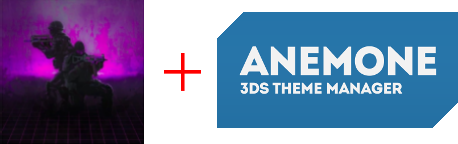
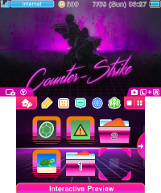

     
    
     
     
    <a href="https://themeplaza.art/profile/TheRake66" target="_blank">
        <b>• View on Theme Plaza •</b>
    </a>
     
     
    <a href="https://github.com/TheRake66/CS-GO-Synthwave/raw/refs/heads/main/CS:GO%20Synthwave.zip" target="_blank">
        <b>• Download here •</b>
    </a>
     
     
    
    
     
     

# CS:GO Synthwave (3DS Theme)

 Custom theme for Anemone3DS inspired by the synthwave remix of CS:GO trailer by Slimek.

 Remix here: [

### Main preview

 

## How to download (on GitHub)?

 Download theme ([CS:GO Synthwave.zip](https://github.com/TheRake66/CS-GO-Synthwave/raw/refs/heads/main/CS:GO%20Synthwave.zip)).

 Transfer files to your 3DS sdcard in `/themes` folder (you can use FTPD).

## How to download (on Theme Plaza)?

 Go on [my profile](https://themeplaza.art/profile/TheRake66) page.

 Scan QR code with Anemone3DS homebrew.

## How to use?

 Set theme on Anemone3DS.

 Have fun! 😉

## License and Usage Restrictions

 This project is licensed under a custom license that **prohibits commercial use**.

 For more details, see the [LICENSE](./LICENSE) file.
